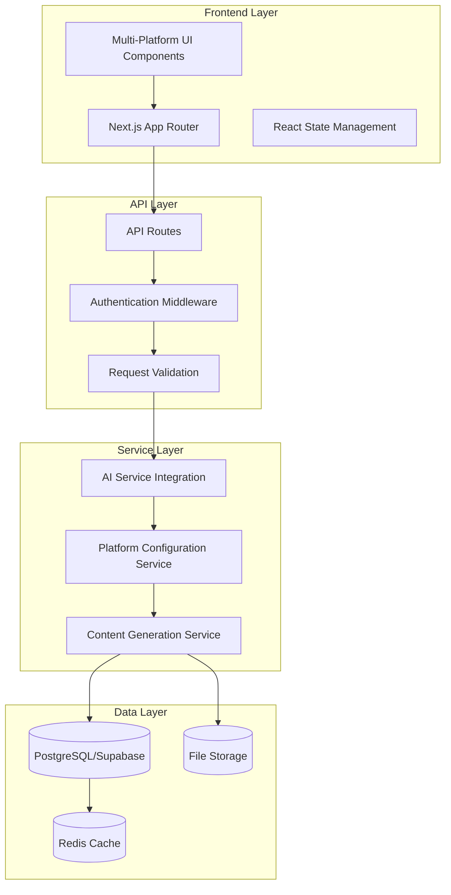

# Multi-Platform Content Optimization Tools - Architecture Design

## Executive Summary

This document outlines the comprehensive architecture for three new multi-platform content optimization tools to be integrated into the BrandVoice AI platform:

1. **AI Thumbnail Generator** - Platform-specific thumbnail generation with custom dimensions and overlays
2. **Title & Description SEO Optimizer** - Multi-platform SEO-optimized content metadata
3. **Hashtag Generator** - Platform-specific hashtag optimization and trending analysis

## Current Infrastructure Analysis

### Existing Tech Stack
- **Frontend**: Next.js 14 with React 18, TypeScript, TailwindCSS
- **Backend**: Next.js API routes with serverless functions
- **Database**: PostgreSQL via Supabase with Prisma ORM
- **AI Integration**: DeepSeek API for content generation
- **Authentication**: Supabase Auth
- **Styling**: Custom Claude-inspired color palette

### Current AI Infrastructure
- **AI Client**: [`lib/ai/deepseek.ts`](lib/ai/deepseek.ts) - Centralized AI service
- **Prompt Engineering**: [`lib/ai/prompts.ts`](lib/ai/prompts.ts) - Structured prompt templates
- **API Pattern**: RESTful endpoints in [`app/api/ai/`](app/api/ai/) directory
- **Response Format**: JSON-based responses with success/error handling

### Current UI Patterns
- **Layout**: Dashboard with sidebar navigation ([`components/dashboard/Sidebar.tsx`](components/dashboard/Sidebar.tsx))
- **Components**: Modular component structure with platform-specific sections
- **Styling**: Consistent design system with TailwindCSS classes
- **State Management**: React hooks and context for component state

## Architecture Overview



## 1. AI Thumbnail Generator Architecture

### Core Features
- Platform-specific dimension presets (YouTube, Instagram, TikTok, LinkedIn, Blog)
- AI-powered visual generation based on content context
- Custom overlay system (text, logos, watermarks)
- Template library with brand consistency
- Batch generation capabilities

### Technical Architecture

#### Database Schema Extension
```prisma
model ThumbnailGeneration {
  id          String   @id @default(uuid())
  userId      String
  platform    Platform
  contentType String   // video, blog, social, etc.
  title       String
  description String?
  prompt      String
  dimensions  Json     // {width: 1920, height: 1080}
  templateId  String?
  overlays    Json[]   // Array of overlay configurations
  imageUrl    String?
  thumbnailUrl String?
  status      GenerationStatus
  metadata    Json?
  createdAt   DateTime @default(now())
  updatedAt   DateTime @updatedAt
  
  @@map("thumbnail_generations")
}

model ThumbnailTemplate {
  id          String   @id @default(uuid())
  name        String
  platform    Platform
  dimensions  Json
  overlays    Json[]
  isDefault   Boolean  @default(false)
  isActive    Boolean  @default(true)
  createdAt   DateTime @default(now())
  updatedAt   DateTime @updatedAt
  
  @@map("thumbnail_templates")
}

enum Platform {
  YOUTUBE
  INSTAGRAM
  TIKTOK
  LINKEDIN
  TWITTER
  BLOG
  GENERIC
}

enum GenerationStatus {
  PENDING
  PROCESSING
  COMPLETED
  FAILED
}
```

#### API Endpoints
```
POST /api/ai/thumbnail/generate
GET  /api/ai/thumbnail/templates
POST /api/ai/thumbnail/templates
PUT  /api/ai/thumbnail/templates/:id
GET  /api/ai/thumbnail/history
POST /api/ai/thumbnail/batch-generate
```

#### Component Structure
```
components/thumbnail/
├── ThumbnailGenerator.tsx          # Main generator component
├── PlatformSelector.tsx           # Platform selection UI
├── DimensionPreset.tsx             # Dimension presets
├── TemplateLibrary.tsx             # Template selection
├── OverlayEditor.tsx               # Overlay configuration
├── PreviewCanvas.tsx               # Live preview
├── BatchGenerator.tsx              # Batch generation UI
└── HistoryGallery.tsx              # Generation history
```

#### AI Integration
```typescript
// lib/ai/thumbnailGenerator.ts
export interface ThumbnailPromptParams {
  platform: Platform
  contentType: string
  title: string
  description?: string
  brandStyle?: string
  colorScheme?: string
  mood?: string
  elements?: string[]
}

export function generateThumbnailPrompt(params: ThumbnailPromptParams): string {
  const platformConfigs = {
    YOUTUBE: {
      dimensions: "1920x1080",
      style: "high-contrast, bold text, eye-catching",
      elements: "title text, subtitle, brand logo"
    },
    INSTAGRAM: {
      dimensions: "1080x1080",
      style: "trendy, minimalist, aesthetic",
      elements: "bold headline, subtle branding"
    },
    TIKTOK: {
      dimensions: "1080x1920",
      style: "vibrant, attention-grabbing, fast-paced",
      elements: "large text, trending elements"
    }
    // ... other platforms
  }
  
  // Generate platform-specific prompt
  return `Generate a thumbnail for ${params.platform}...`
}
```

## 2. Title & Description SEO Optimizer Architecture

### Core Features
- Multi-platform title and description optimization
- SEO keyword analysis and integration
- Character limit enforcement per platform
- A/B testing capabilities
- Performance tracking and analytics

### Technical Architecture

#### Database Schema Extension
```prisma
model SEOGeneration {
  id            String   @id @default(uuid())
  userId        String
  platform      Platform
  contentType   String
  originalTitle String?
  originalDesc  String?
  optimizedTitle String
  optimizedDesc String
  keywords      String[]
  seoScore      Float?
  characterCount Json    // {title: 50, description: 200}
  variations    Json[]   // A/B test variations
  performance   Json?    // Performance metrics
  createdAt     DateTime @default(now())
  updatedAt     DateTime @updatedAt
  
  @@map("seo_generations")
}

model SEOKeyword {
  id          String   @id @default(uuid())
  keyword     String
  platform    Platform
  competition String   // low, medium, high
  volume      Int?
  difficulty  Float?
  trend       String   // rising, stable, declining
  lastUpdated DateTime @default(now())
  
  @@map("seo_keywords")
}
```

#### API Endpoints
```
POST /api/ai/seo/optimize
GET  /api/ai/seo/keywords
POST /api/ai/seo/analyze
GET  /api/ai/seo/history
POST /api/ai/seo/ab-test
GET  /api/ai/seo/performance
```

#### Component Structure
```
components/seo/
├── SEOOptimizer.tsx               # Main optimizer component
├── TitleEditor.tsx                 # Title optimization UI
├── DescriptionEditor.tsx           # Description optimization UI
├── KeywordAnalyzer.tsx             # Keyword analysis UI
├── CharacterCounter.tsx            # Platform-specific limits
├── SEOScore.tsx                    # SEO score display
├── ABTestManager.tsx              # A/B testing interface
└── PerformanceTracker.tsx          # Performance analytics
```

#### AI Integration
```typescript
// lib/ai/seoOptimizer.ts
export interface SEOPromptParams {
  platform: Platform
  contentType: string
  title: string
  description?: string
  keywords: string[]
  targetAudience?: string
  tone?: string
}

export function generateSEOPrompt(params: SEOPromptParams): string {
  const platformLimits = {
    YOUTUBE: { title: 100, description: 5000 },
    INSTAGRAM: { title: 125, description: 2200 },
    TIKTOK: { title: 150, description: 150 },
    LINKEDIN: { title: 200, description: 3000 }
  }
  
  return `Optimize this content for ${params.platform} with SEO best practices...`
}
```

## 3. Hashtag Generator Architecture

### Core Features
- Platform-specific hashtag generation
- Trending hashtag analysis
- Hashtag performance tracking
- Niche hashtag discovery
- Hashtag grouping and categorization

### Technical Architecture

#### Database Schema Extension
```prisma
model HashtagGeneration {
  id          String   @id @default(uuid())
  userId      String
  platform    Platform
  contentType String
  content     String
  hashtags    String[]
  categories  Json[]   // Grouped by category
  trending    String[]
  niche       String[]
  performance Json?     // Performance metrics
  createdAt   DateTime @default(now())
  updatedAt   DateTime @updatedAt
  
  @@map("hashtag_generations")
}

model HashtagTrend {
  id          String   @id @default(uuid())
  platform    Platform
  hashtag     String
  usage       Int
  growth      Float    // Growth rate
  category    String
  isTrending  Boolean  @default(false)
  lastUpdated DateTime @default(now())
  
  @@map("hashtag_trends")
}
```

#### API Endpoints
```
POST /api/ai/hashtags/generate
GET  /api/ai/hashtags/trending
GET  /api/ai/hashtags/categories
POST /api/ai/hashtags/analyze
GET  /api/ai/hashtags/performance
POST /api/ai/hashtags/track
```

#### Component Structure
```
components/hashtags/
├── HashtagGenerator.tsx           # Main generator component
├── PlatformSelector.tsx           # Platform selection
├── TrendingHashtags.tsx           # Trending display
├── HashtagCategories.tsx          # Category grouping
├── HashtagAnalyzer.tsx            # Performance analysis
├── NicheDiscovery.tsx             # Niche hashtag finder
└── PerformanceTracker.tsx         # Hashtag performance
```

#### AI Integration
```typescript
// lib/ai/hashtagGenerator.ts
export interface HashtagPromptParams {
  platform: Platform
  content: string
  contentType: string
  targetAudience?: string
  goals?: string[]  // engagement, reach, etc.
  excludeHashtags?: string[]
}

export function generateHashtagPrompt(params: HashtagPromptParams): string {
  const platformStrategies = {
    INSTAGRAM: {
      mix: "broad, niche, and location-specific hashtags",
      count: "20-30 hashtags",
      strategy: "high engagement, visual content focus"
    },
    TIKTOK: {
      mix: "trending and niche hashtags",
      count: "3-5 hashtags",
      strategy: "viral potential, trend-focused"
    },
    LINKEDIN: {
      mix: "professional and industry-specific hashtags",
      count: "3-5 hashtags",
      strategy: "professional networking, B2B focus"
    }
  }
  
  return `Generate optimized hashtags for ${params.platform}...`
}
```

## 4. Platform Configuration System

### Centralized Platform Management
```typescript
// lib/platforms/config.ts
export interface PlatformConfig {
  id: Platform
  name: string
  icon: string
  color: string
  dimensions: {
    thumbnail: { width: number; height: number }
    cover: { width: number; height: number }
  }
  limits: {
    title: number
    description: number
    hashtags: number
  }
  features: {
    thumbnail: boolean
    seo: boolean
    hashtags: boolean
  }
  aiPrompts: {
    thumbnail: string
    seo: string
    hashtags: string
  }
}

export const PLATFORM_CONFIGS: Record<Platform, PlatformConfig> = {
  YOUTUBE: {
    id: 'YOUTUBE',
    name: 'YouTube',
    icon: '📺',
    color: '#FF0000',
    dimensions: {
      thumbnail: { width: 1920, height: 1080 },
      cover: { width: 1280, height: 720 }
    },
    limits: {
      title: 100,
      description: 5000,
      hashtags: 15
    },
    features: {
      thumbnail: true,
      seo: true,
      hashtags: true
    },
    aiPrompts: {
      thumbnail: 'Generate eye-catching YouTube thumbnails...',
      seo: 'Optimize YouTube titles and descriptions...',
      hashtags: 'Generate YouTube-optimized hashtags...'
    }
  },
  // ... other platforms
}
```

## 5. Component Reusability Strategy

### Shared Component Library
```
components/shared/
├── PlatformSelector.tsx           # Reusable platform picker
├── ContentInput.tsx               # Standardized content input
├── GenerationHistory.tsx          # Common history component
├── PerformanceMetrics.tsx         # Shared analytics display
├── AIThinking.tsx                 # AI processing indicator
├── ExportOptions.tsx              # Export functionality
└── BrandStyleSelector.tsx         # Brand consistency controls
```

### Hook-based Logic
```typescript
// hooks/usePlatformConfig.ts
export function usePlatformConfig(platform: Platform) {
  return useMemo(() => PLATFORM_CONFIGS[platform], [platform])
}

// hooks/useAIGeneration.ts
export function useAIGeneration<T>(endpoint: string, params: any) {
  const [data, setData] = useState<T | null>(null)
  const [loading, setLoading] = useState(false)
  const [error, setError] = useState<string | null>(null)
  
  const generate = useCallback(async () => {
    setLoading(true)
    setError(null)
    try {
      const response = await fetch(endpoint, {
        method: 'POST',
        headers: { 'Content-Type': 'application/json' },
        body: JSON.stringify(params)
      })
      const result = await response.json()
      setData(result)
    } catch (err) {
      setError(err.message)
    } finally {
      setLoading(false)
    }
  }, [endpoint, params])
  
  return { data, loading, error, generate }
}
```

## 6. API Design Patterns

### Standardized Response Format
```typescript
interface APIResponse<T> {
  success: boolean
  data?: T
  error?: string
  metadata?: {
    timestamp: string
    requestId: string
    processingTime: number
  }
}
```

### Request Validation Middleware
```typescript
// middleware/validation.ts
export function validateRequest<T>(schema: ZodSchema<T>) {
  return async (request: NextRequest) => {
    try {
      const body = await request.json()
      return schema.parse(body)
    } catch (error) {
      throw new ValidationError(error.message)
    }
  }
}
```

### Rate Limiting and Quotas
```typescript
// lib/rateLimit.ts
export async function checkRateLimit(
  userId: string,
  endpoint: string,
  limit: number
) {
  const key = `rate_limit:${userId}:${endpoint}`
  const current = await redis.incr(key)
  
  if (current === 1) {
    await redis.expire(key, 3600) // 1 hour
  }
  
  if (current > limit) {
    throw new RateLimitExceededError('Rate limit exceeded')
  }
  
  return { remaining: limit - current, resetIn: await redis.ttl(key) }
}
```

## 7. Integration with Existing AI Infrastructure

### Extended AI Service
```typescript
// lib/ai/index.ts
export * from './deepseek'
export * from './thumbnailGenerator'
export * from './seoOptimizer'
export * from './hashtagGenerator'

// Unified AI client
export class AIClient {
  static async generateThumbnail(params: ThumbnailPromptParams) {
    return generateWithDeepSeek(generateThumbnailPrompt(params))
  }
  
  static async optimizeSEO(params: SEOPromptParams) {
    return generateWithDeepSeek(generateSEOPrompt(params))
  }
  
  static async generateHashtags(params: HashtagPromptParams) {
    return generateWithDeepSeek(generateHashtagPrompt(params))
  }
}
```

### Brand Voice Integration
```typescript
// lib/ai/brandIntegration.ts
export function integrateBrandVoice(
  basePrompt: string,
  brandProfile: BrandProfile
): string {
  const brandContext = `
  BRAND CONTEXT:
  - Name: ${brandProfile.name}
  - Tone: ${brandProfile.tone}
  - Audience: ${brandProfile.audience}
  - Values: ${brandProfile.values.join(', ')}
  - Style: ${brandProfile.style}
  `
  
  return `${brandContext}\n\n${basePrompt}`
}
```

## 8. Performance and Caching Strategy

### Multi-Level Caching
```typescript
// lib/cache.ts
export class CacheManager {
  static async get<T>(key: string): Promise<T | null> {
    // Try memory cache first
    if (memoryCache.has(key)) {
      return memoryCache.get(key)
    }
    
    // Try Redis cache
    const cached = await redis.get(key)
    if (cached) {
      const data = JSON.parse(cached)
      memoryCache.set(key, data)
      return data
    }
    
    return null
  }
  
  static async set(key: string, value: any, ttl: number = 3600) {
    memoryCache.set(key, value)
    await redis.setex(key, ttl, JSON.stringify(value))
  }
}
```

### Background Processing
```typescript
// lib/queue.ts
export class GenerationQueue {
  static async enqueue(job: GenerationJob) {
    await redis.lpush('generation_queue', JSON.stringify(job))
  }
  
  static async process() {
    const job = await redis.brpop('generation_queue', 0)
    if (job) {
      const jobData = JSON.parse(job[1])
      await this.processJob(jobData)
    }
  }
}
```

## 9. Security and Privacy

### Content Moderation
```typescript
// lib/moderation.ts
export async function moderateContent(content: string): Promise<boolean> {
  const toxicityCheck = await checkToxicity(content)
  const copyrightCheck = await checkCopyright(content)
  
  return !toxicityCheck && !copyrightCheck
}
```

### Data Privacy
```typescript
// lib/privacy.ts
export function sanitizeUserData(data: any): any {
  const sensitiveFields = ['email', 'phone', 'address']
  const sanitized = { ...data }
  
  sensitiveFields.forEach(field => {
    delete sanitized[field]
  })
  
  return sanitized
}
```

## 10. Monitoring and Analytics

### Performance Tracking
```typescript
// lib/analytics.ts
export class AnalyticsTracker {
  static async trackGeneration(
    userId: string,
    tool: string,
    platform: Platform,
    success: boolean,
    processingTime: number
  ) {
    await analytics.track('generation_completed', {
      userId,
      tool,
      platform,
      success,
      processingTime,
      timestamp: new Date().toISOString()
    })
  }
}
```

### Error Tracking
```typescript
// lib/errorTracking.ts
export function trackError(error: Error, context: any) {
  console.error('Application Error:', error, context)
  
  // Send to error tracking service
  errorTracker.captureException(error, {
    tags: context,
    extra: { stack: error.stack }
  })
}
```

## Implementation Roadmap

### Phase 1: Core Infrastructure (Week 1-2)
1. Database schema extensions
2. Platform configuration system
3. Basic API endpoints
4. Shared component library
5. AI service integration

### Phase 2: Thumbnail Generator (Week 3)
1. Core generation logic
2. Platform-specific templates
3. Overlay system
4. Preview functionality
5. Batch generation

### Phase 3: SEO Optimizer (Week 4)
1. Title and description optimization
2. Keyword analysis
3. SEO scoring system
4. A/B testing framework
5. Performance tracking

### Phase 4: Hashtag Generator (Week 5)
1. Hashtag generation logic
2. Trending analysis
3. Performance tracking
4. Category grouping
5. Niche discovery

### Phase 5: Integration and Polish (Week 6)
1. Cross-tool integration
2. UI/UX refinements
3. Performance optimization
4. Testing and QA
5. Documentation

## Conclusion

This architecture provides a comprehensive, scalable foundation for the three multi-platform content optimization tools while maintaining consistency with the existing BrandVoice AI infrastructure. The modular design allows for easy maintenance, feature additions, and platform expansions.

Key architectural benefits:
- **Scalability**: Modular components and services
- **Maintainability**: Clear separation of concerns
- **Extensibility**: Easy to add new platforms and features
- **Performance**: Caching and optimization strategies
- **Security**: Built-in moderation and privacy controls
- **Integration**: Seamless connection with existing AI infrastructure

The design leverages the current tech stack while introducing modern patterns for multi-platform content optimization, ensuring a robust and user-friendly experience.